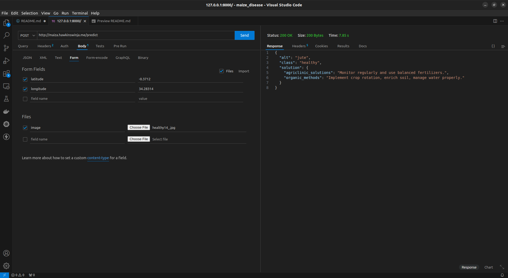

# MAIZA API- Backed API for Maize Leaf Disease Prediction
> MAIZA API is a backend project that classifies the health status of a Maize Leaf from captured Image.

    The models are trained on data from [Mensah et al](#maiza-api--backed-api-for-maize-leaf-disease-prediction)
    The model can classify the image into seven classes, ie., Fallarmyworm, Grasshopper, Healthy, Leafbeetle, Leafblight, Leafspot, and Streakvirus.


[API Link](http://maiza.hawkinswinja.me/)

Endpoints available:
- / : Welcome page (GET)
- /status: Returns the status of the API (GET)
- /predict: Returns the prediction and recommendation (POST)

The endpoint for prediction and classification is at '/predict'. The endpoint only accepts POST requests.
    
Required data and field labels for the prediction are:
- latitude: latitude coordinate of the user
- longitude: longitude coordinate of the user
- image: uploaded image file of the maize file

> Below is a demonstration of a POST request and the returned response.




## Requirements
- python 3.10 +
- docker (optional)

## Installation
 - Clone this repository to your local machine and change into the directory
     ```
     git clone https://github.com/hawkinswinja/maiza-api.git && cd maiza-api
     ```
- Create and activate a virtual environment
    ```
    python -m venv virt && source virt/bin/activate

    # windows
    python -m venv virt && source virt\Scripts\activate
    ```
- Install dependencies listed in requirements.txt
    ```
    python -m pip install -r requirements.txt
    ```
- launch the server using gunicorn (ubuntu)
    ```
    gunicorn server.app:app
    ```
    - use waitress for windows 
    ```
    waitress-serve --listen=*:8000 server.app:app
    ```

- access the url at `127.0.0.1:8000`

> alternatively if using docker, run the following command to run the image

```
docker pull hawkinswinja/maiza:v4
docker run -p 8000:5000 -v ./server/.env:/app/.env 
```

<!-- ## Areas to improve and contribute
This project could really use contributions. Feel free to fork the repo and make pull requests for improvements
- Limit registration to only the profile user i.e county admin can view players in academy but cannot register anew player
- Facial recognition to identify player basedd on their images
- Asynchronous database actions -->

&copy; hawkinswinja